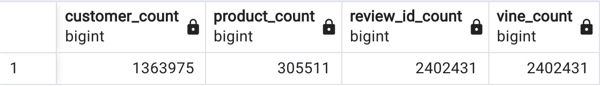
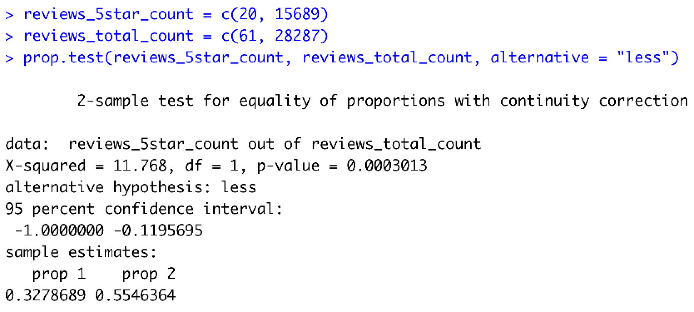

  

# Amazon Vine Analysis
Big Data: Analyze Vine Reviews with AWS S3 Scalable Storage in the Cloud and PostgreSQL AWS RDS Managed Relational Database Service

## Overview


 

## Methods

This study is an exercise in cloud-based ETL, cloud-based data retrieval, and data analysis. This section outlines a typical cloud-based workflow.

The dataset used contains 2,402,431 reviews of grocery products as a tab separated value file `amazon_reviews_us_Grocery_v1_00.tsv` obtained from [Amazon Review Datasets](https://s3.amazonaws.com/amazon-reviews-pds/tsv/index.txt).

### ETL: Extract, Transform, Load

The first part of the study is cloud-based ETL.

#### Extract

- Obtain the tsv file
- Store the tsv in an AWS S3 bucket

#### Transform

- Use PySpark in Google Colaboratory to create a DataFrame from the tsv
- Remove mis-parsed records that occurred during spark.read of the tsv
- Create four DataFrames to match the four database tables

#### Load

- Create a PostgreSQL database on AWS RDS using pgAdmin
- Create database tables using pgAdmin

```
CREATE TABLE review_id_table (
  review_id TEXT PRIMARY KEY NOT NULL,
  customer_id INTEGER,
  product_id TEXT,
  product_parent INTEGER,
  review_date DATE -- this should be in the formate yyyy-mm-dd
);

-- This table will contain only unique values
CREATE TABLE products_table (
  product_id TEXT PRIMARY KEY NOT NULL UNIQUE,
  product_title TEXT
);

-- Customer table for first data set
CREATE TABLE customers_table (
  customer_id INT PRIMARY KEY NOT NULL UNIQUE,
  customer_count INT
);

-- vine table
CREATE TABLE vine_table (
  review_id TEXT PRIMARY KEY,
  star_rating INTEGER,
  helpful_votes INTEGER,
  total_votes INTEGER,
  vine TEXT,
  verified_purchase TEXT
);
```
Fig. Create database tables with given schema.

- Connect to the AWS RDS instance and write each DataFrame to its database table
- Inspect each DataFrame for correct schema (see [Amazon_Reviews_ETL.ipynb](https://github.com/graemet-umich/Amazon_Vine_Analysis/blob/main/Amazon_Reviews_ETL.ipynb))
- Get table counts using pgAdmin as another check that the database tables were written to correctly

```
-- Get table counts
SELECT  (
        SELECT COUNT(*)
        FROM   customers_table
        ) AS customer_count,
        (
        SELECT COUNT(*)
        FROM   products_table
        ) AS product_count,
        (
        SELECT COUNT(*)
        FROM   review_id_table
        ) AS review_id_count,
        (
        SELECT COUNT(*)
        FROM   vine_table
        ) AS vine_count
```
SQL Query. Get the total number of records from each of the database tables.


Table. The number of records in each of the four PostgreSQL tables. 1,363,975 customers generated 2,402,431 reviews of 305,551 grocery products.

### Prepare Data for Bias of Vine Reviews Analysis

- Use PySpark in Google Colaboratory to read the vine_count table stored in the AWS RDS PostgreSQL database into a DataFrame
- Only consider reviews with at least 20 total votes
- Only consider reviews where at least 50% of the total votes are helpful votes
- Separate Vine reviews and non-Vine reviews into two DataFrames for analysis.

| State | Number of Records |
| --- | ---: |
| original tsv | 2,402,458 |
| remove mis-parsed records | 2,402,431 |
| total_votes >= 20 | 31,518 |
| helpful to total votes >= 0.5 | 28,348 |
| Vine reviews | 61 |
| non-Vine reviews | 28,287 |

Table. How filtering and splitting the data affect the number of records (see [Vine_Review_Analysis.ipynb](https://github.com/graemet-umich/Amazon_Vine_Analysis/blob/main/Vine_Review_Analysis.ipynb) for details).


## Results

The summary statistics are displayed in the table below to determine the bias of Vine reviews compared to non-Vine reviews.

- **Total Vine and non-Vine reviews.** The total number of Vine reviews is 61, and the total number of non-Vine reviews is 28,287.
- **5-star Vine and non-Vine reviews.** The total number of 5-star Vine reviews is 20, and the total number of 5-star non-Vine reviews is 15,689.
- **Percentage of 5-star Vine and non-Vine reviews.** The percentage of 5-star Vine reviews is 33%, and the percentage of 5-star non-Vine reviews is 55.5%.

| Summary | Vine | non-Vine |
| --- | :---: | :---: |
| total reviews | 61 | 28,287 |
| 5-star reviews | 20 | 15,689 |
| percentage 5-star | 33% | 55.5% |

Table. Summary of number of total reviews, number of 5-star reviews, and percentage of 5-star reviews for Vine reviews and non-Vine reviews. 

- **Significance 5-star review percentage difference between Vine and non-Vine reviews.** The percentage of 5-star Vine reviews (33%) is significantly less than the percentage of 5-star non-Vine reviews (55.5%) (p=0.0003).


Fig. A two-sample test for equality of proportions in R. The reviews_5star_count is the number of 5-star reviews. The reviews_total_count is the total number of reviews. The first element of each vector refers to the number of Vine reviews. The second element of each vector refers to the number of non-Vine reviews.


## Summary


